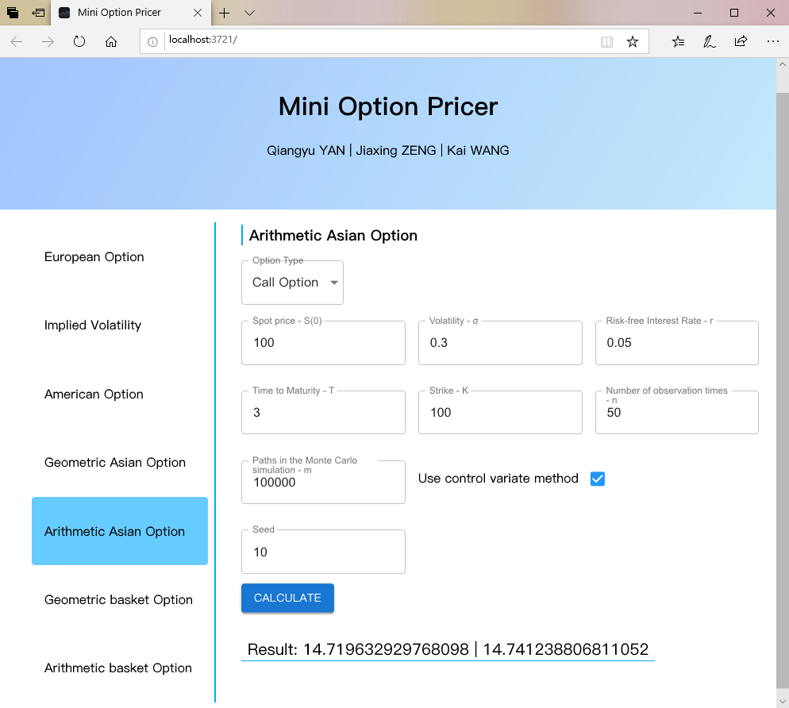

#  Interface Introduction

The User Interface is developed using *Flask* (A python web framework) and *HTML* & *CSS* & *JavaScript*. It's a webpage.



Look at the snapshot above. There is a menu on the left panel which can be click and navigate to different option pricer calculator. On the right panel, it provides several input fields, such as Option Type, Spot Price and so on.

After filling in these input fields, we can click on the button "CALCULATE" and the result will be displayed below.

# Functionalities Explanation

## Overview Directory Structure

```shel
.
├── option_pricer
│   ├── binomial_tree.py        # American options
│   ├── black_scholes.py        # European options
│   ├── closed_form_formulas.py # Geometric Asian/Basket options
│   ├── implied_volatility.py   # Implied volatility calculator
│   ├── MC.py                   # Monte Carlo Method (Arithmetic Asian/Basket option)
│   ├── server.py               # HTTP Server
│   └── static                  # Web User Interface compiled file directory
├── README.md
├── requirement.txt             # Python Dependencies
└── web                         # Web User Interface source code
```

